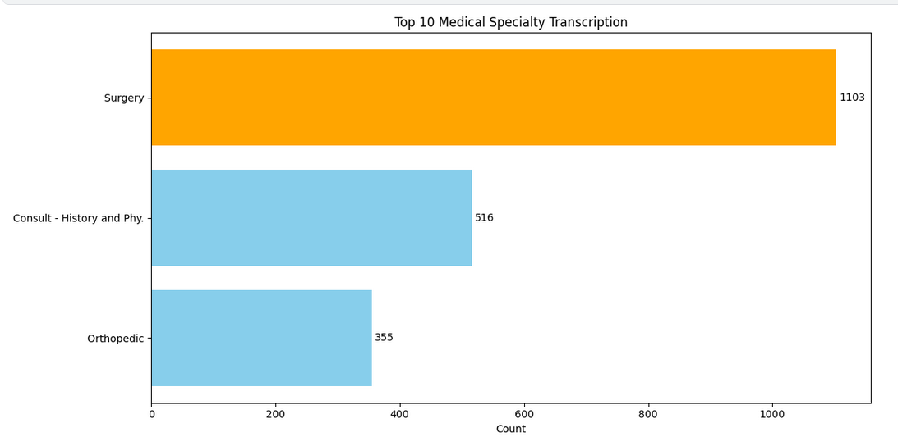

# Medical-Transcript-Summarization

## 1. Project Overview
This project develops a robust and efficient medical transcription summarization system capable of accurately condensing detailed medical transcripts (consultations, surgeries script, orthopedic reports) into concise, medically-relevant summaries using the IBM Granite 3.3 language model fine-tuned with the Unsloth framework.
### 1.1 Purpose : 
- Time-Saving: Doctors and administrative staff spend hours reviewing lengthy transcripts. Summarization streamlines this process.
- Medical Relevance: Ensuring summaries retain clinically significant details across specialized domains like orthopedics and surgical procedures.
### 1.2 Tech Stack :
1. Fine-tuning : 	Unsloth (fast & memory-efficient LLM training)
2. Framework	: PyTorch, Hugging Face Transformers
3. Data Handling	: Pandas, Datasets, KeyBert
4. Model : IBM Granite 3.2 Instruct
5. Evaluation	: BERTScore

### 1.3 Analysis Process :
1. Data & library import
2. EDA (Exploratory Data Analysis) 
3. Data Preprocessing 
    - Text Preprocessing: 
        - Remove leading/trailing whitespaces
        - Remove excess spaces and newlines
        - Remove non-ASCII characters
        - Remove multiple spaces
    - Filtering top keywords filtering by KeyBert with 22 top keywords and keyphrase n-gram (1,2) 
    - Data spliting (train, validation, test)
    - prompt formatting and data tokenization
4. Model training 
5. Model Evaluation

## 2. Raw Data Links 
To develops this model, I use this Medical Transcriptions dataset from Kaggle : https://www.kaggle.com/datasets/tboyle10/medicaltranscriptions

## 3. Insights and found
### 3.1 Dataset Overview 
The full dataset consists of 4,999 rows with transcription and description of 40 categories. In this project, I only use 3 transcription categories including , surgery, orthopedic , and consultation transcription with 1,974 rows.
### 3.2 Insights & Findings : 
- Transcription Categories

In this dataset, most of the transcriptions data are Surgery, with the total of 1103 row. The other transcription are Consult - History and Phy (516 rows) and Orthopedic (355 rows).
- Words distribution 
    - Before text filtering with KeyBert : 
        - median of words in the transcription :  492
        - max of words in the transcription : 2242
    - After : 
        - median words after cleaning :  41.0
        - max words after cleaning :  44.0
### 3.3 Model Training : 
- The model trained with input column : "transcription" and output column : "description" (summary result)
- The model trained with 150 Steps with training data (1246 rows) and validation dataset (156 rows)
- Then, the model tested with 156 rows of test data 
### 3.4 Model Evaluation : 
- Precision : 0.745
- Recall : 0.817
- F1 : 0.7782

- Interpretation : 
    - Good recall, moderate precision: The model captures most key ideas from the original transcription, but might be adding extra, slightly off-topic or unnecessary info.
    - F1 of ~77.8% is strong for medical summarization tasks, especially given the complexity of the domain (medical terms, factual correctness, abbreviation handling).
